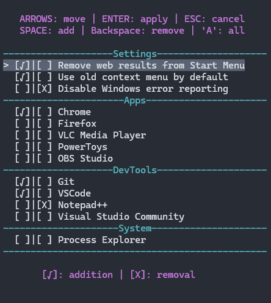

# A simple powershell script with a ui to change a few settings which are not easily accessible and/or install some programs from winget.




recommended to use with powershell 7
```
winget install -e --id Microsoft.PowerShell -i
```
